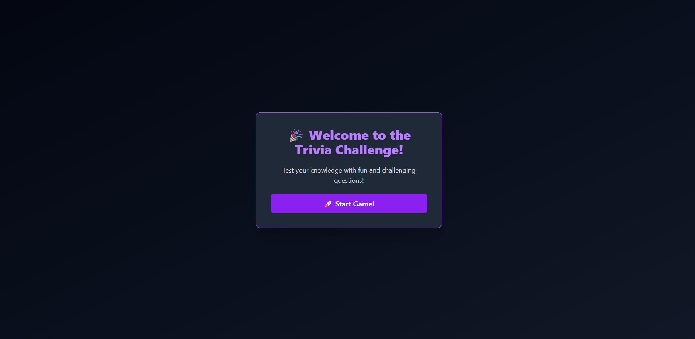
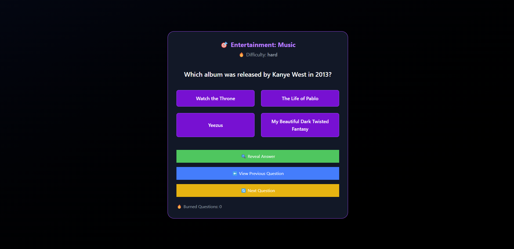
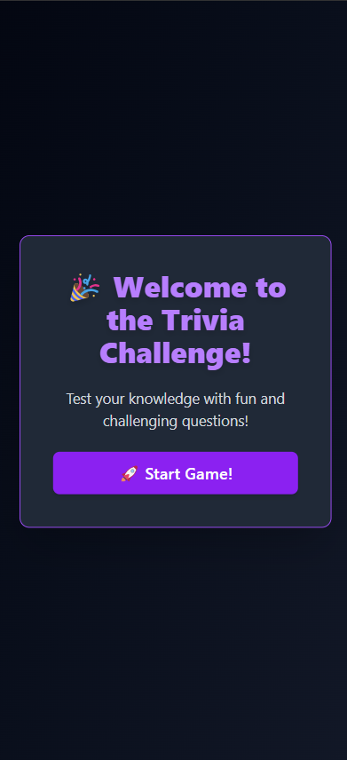
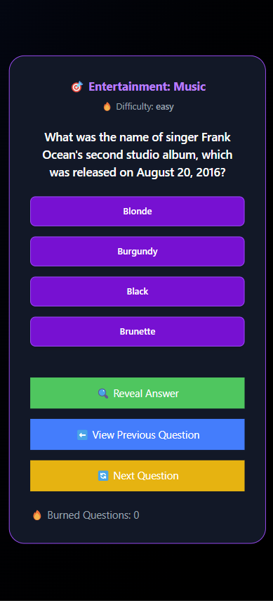

# 🎉 Trivia Game - React App

## 📌 Descripción
Trivia Game es una aplicación de preguntas y respuestas interactivas desarrollada con **React** y gestionada con **Zustand** para el estado global. Los usuarios pueden probar sus conocimientos en diferentes categorías y dificultades, con preguntas obtenidas en tiempo real desde la API de **Open Trivia Database**.

Esta Web App fue desarrollada para una prueba técnica de Desarrollador Frontend.

💡 **Desarrollado por @hdtoledo para una prueba técnica.** 🚀

🚀 **[Prueba la demo en vivo aquí](https://trivia-game-git-master-hdtoledos-projects.vercel.app)**

---

## 🎨 Vista Previa





---

## 🛠️ Prerrequisitos
- Tener instalado [Node.js](https://nodejs.org/)
- Tener instalado [Yarn](https://yarnpkg.com/) o usar `npm`

---

## 🚀 Tecnologías Utilizadas

| Tecnología | Descripción |
|------------|-------------|
| **React** | Biblioteca para construir la UI |
| **Zustand** | Gestión de estado global |
| **React Query** | Manejo de datos asíncronos |
| **TypeScript** | Tipado estático y mejor mantenimiento del código |
| **Tailwind CSS** | Estilos modernos y responsivos |

---

## 📂 Estructura del Proyecto
```
TriviaGame/
│── src/
│   │── components/
│   │   │── WelcomeScreen.tsx  # Pantalla de bienvenida
│   │   │── TriviaScreen.tsx   # Pantalla de preguntas
│   │── store/
│   │   │── useTriviaStore.ts  # Estado global con Zustand
│   │── App.tsx                 # Componente principal
│── public/
│── package.json
│── README.md
```

---

## ⚡ Instalación y Ejecución

### 1️⃣ **Clonar el repositorio**
```bash
git clone https://github.com/tu-usuario/trivia-app.git
cd trivia-app
```

### 2️⃣ **Instalar dependencias**
```bash
yarn install  # O npm install
```

### 3️⃣ **Ejecutar el proyecto en modo desarrollo**
```bash
yarn dev  # O npm run dev
```

📌 **El servidor se ejecutará en** `http://localhost:5173/` (Vite por defecto).

---

## 🎮 Cómo Jugar

1️⃣ Inicia la aplicación y presiona **"Start Game"**.  
2️⃣ Responde la pregunta seleccionando una opción.  
3️⃣ Si tienes dudas, puedes **revelar la respuesta** antes de continuar.  
4️⃣ Puedes **ver preguntas anteriores** para revisar tu historial.  
5️⃣ Responde tantas preguntas como quieras y mide tu conocimiento. 🧠✨  

---

## 🎨 Diseño y UX/UI
- Se utilizó **Tailwind CSS** para una apariencia moderna y responsiva.
- La paleta de colores sigue un enfoque oscuro con tonos **púrpura y azul** para dar una sensación de misterio y tecnología.
- Los botones tienen animaciones para mejorar la interactividad.

---

## 🛠️ Funcionalidades Principales
✅ **Carga preguntas desde una API en tiempo real**  
✅ **Gestión de estado con Zustand**  
✅ **Interfaz responsiva y moderna con Tailwind CSS**  
✅ **Historial de preguntas contestadas**  
✅ **Opciones aleatorias en cada pregunta**  
✅ **Navegación entre preguntas y opción de "quemar" preguntas**  

---

## 🌍 API Utilizada
El proyecto obtiene preguntas de **[Open Trivia Database](https://opentdb.com/api_config.php)**, una API gratuita que proporciona preguntas de trivia en varias categorías y niveles de dificultad.

### 📥 **Ejemplo de respuesta de la API:**
```json
{
  "response_code": 0,
  "results": [
    {
      "category": "Science: Computers",
      "type": "multiple",
      "difficulty": "easy",
      "question": "What does CPU stand for?",
      "correct_answer": "Central Processing Unit",
      "incorrect_answers": [
        "Central Process Unit",
        "Computer Personal Unit",
        "Central Processor Unit"
      ]
    }
  ]
}
```

---

## 📌 Estado Global con Zustand
El estado de la aplicación está gestionado con **Zustand** para un manejo más eficiente y sencillo.

```tsx
const useTriviaStore = create<TriviaState>()(
  devtools((set, get) => ({
    gameStarted: false,
    questions: [],
    currentQuestionIndex: 0,
    burnedQuestions: 0,
    history: [],

    startGame: async () => {
      await get().getNewQuestions();
      set({ gameStarted: true, currentQuestionIndex: 0 }, false, "startGame");
    },

    getNewQuestions: async () => {
      const response = await fetch("https://opentdb.com/api.php?amount=10&type=multiple");
      const result = await response.json();
      set({ questions: result.results.map(formatQuestion) }, false, "getNewQuestions");
    }
  }))
);
```

📌 **Explicación rápida:**  
- `startGame()` inicia el juego y obtiene nuevas preguntas.  
- `getNewQuestions()` obtiene datos de la API y los almacena en el estado global.  
- `nextQuestion()` avanza a la siguiente pregunta.  
- `saveCurrentQuestion()` guarda el historial de respuestas.  

---

## 📜 Licencia
Este proyecto está bajo la **MIT License**. Puedes usarlo y modificarlo libremente. 😊  